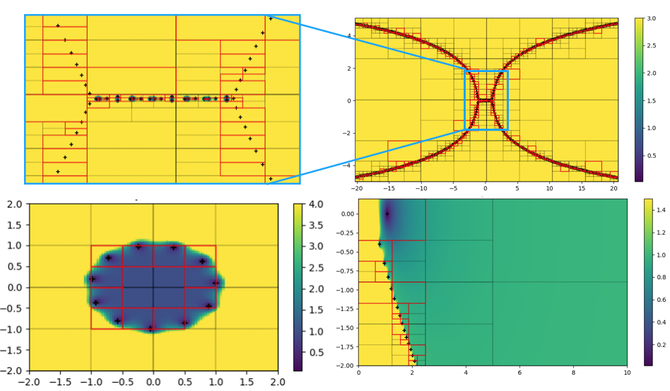

====
FART
====

.. image:: https://img.shields.io/pypi/v/fart.svg
        :target: https://pypi.python.org/pypi/fart

.. image:: https://img.shields.io/travis/LaboratoryOfPlasmaPhysics/fart.svg
        :target: https://travis-ci.org/LaboratoryOfPlasmaPhysics/fart

.. image:: https://readthedocs.org/projects/fart/badge/?version=latest
        :target: https://fart.readthedocs.io/en/latest/?badge=latest
        :alt: Documentation Status

Find All Roots with a Tree

* Free software: GNU General Public License v3
* Documentation: https://fart.readthedocs.io.

Features
--------

* Find roots of arbitrary analytic functions

TODOs
-----

* improve solver with numerical derivative when no analytical derivative is provided
* optimize integration time
*

Developers
----------

FART was developed by:

- Antoine Tavant (LPP)
- Nicolas Aunai (LPP)
- Alexis Jeandet (LPP)

Credits
-------

FART was developed in the LPP_ summer 2018 Hackathon and acknowledges supports of the Laboratory of Plasma Physics
and thanks all participants of the 2018 Hackathon.

This package was created with Cookiecutter_ and the `audreyr/cookiecutter-pypackage`_ project template.

.. _LPP: https://www.lpp.polytechnique.fr
.. _Cookiecutter: https://github.com/audreyr/cookiecutter
.. _`audreyr/cookiecutter-pypackage`: https://github.com/audreyr/cookiecutter-pypackage
